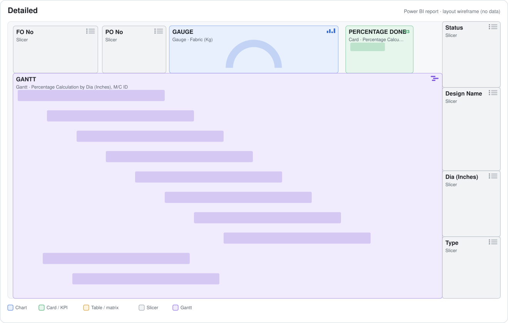
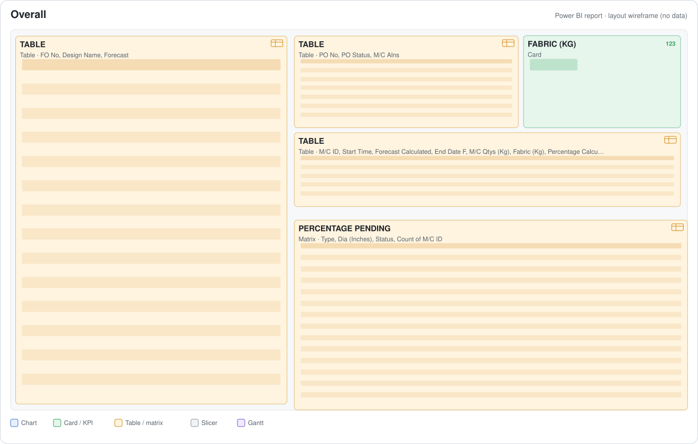
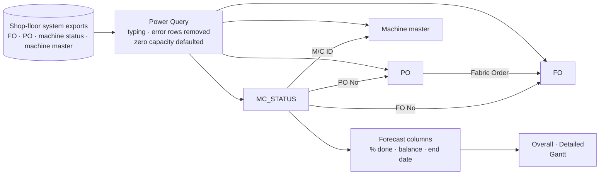

# Knitting Machine Status & Completion Forecast — Power BI

**A live view of the circular-knitting floor: which machine is running which design for which fabric order, how far each job has got, and when each machine will be free. The finish date is forecast from the machine's actual running rate when the shop-floor system has no forecast.**


<p align="center"></p>

> Built for a knitted-apparel manufacturer. The report runs on live company data, so the `.pbix` and its data are not published. Page images are layout wireframes generated from the report definition, and the DAX is exported from the model.

---

## The problem

The knitting shop-floor system reports four things separately: fabric orders (FO), production orders (PO) with yarn consumption and loss, machine status (job, start time, kg planned vs produced, capacity, efficiency) and a machine master (type, make, diameter, gauge). The aim is one screen showing **load per machine and expected free date**, even when the system's own forecast is blank.

## What the report does

- **Progress per machine:** % complete = fabric produced ÷ machine quantity, plus balance kg.
- **Two finish-date forecasts:**
  - *Capacity-based:* balance kg ÷ rated capacity (kg/day) added to today.
  - *Rate-based fallback:* when the system forecast is missing, the actual running rate since start (kg ÷ days running) is projected over the remaining kg. It is formatted like the system's own `"3d 4hrs"` text, then parsed back into a datetime.
- **Gantt timeline** of machines grouped by diameter, coloured by design, with % completion.
- **Pending matrix** of machine count by type × diameter × status.

## Report pages

| Page | Answers | |
|---|---|---|
| **Overall** | Fabric orders and forecasts, PO status, machine job table (start, forecast, end, kg planned vs produced, %), machines by type / diameter / status | [layout](docs/pages/01-overall.svg) |
| **Detailed** | Gantt of every running job by diameter, gauge of produced vs planned kg, % done, slicers for FO, PO, design, status, diameter, type | [layout](docs/pages/02-detailed.svg) |

<details>
<summary>Show the Overall page layout</summary>


</details>

## How it works



### Rate-based forecast when the system has none

```dax
Forecast Calculated =
VAR OrigForecast = MC_Status[Forecast]
VAR HasForecast  = NOT ISBLANK ( OrigForecast ) && LEN ( OrigForecast ) > 3 && FIND ( "d", OrigForecast, 1, 0 ) > 0
RETURN
IF ( HasForecast, OrigForecast,
    IF ( NOT ISBLANK ( MC_Status[Start Time] ) && MC_Status[Fabric (Kg)] > 0,
        VAR DaysRunning   = MAX ( DATEDIFF ( MC_Status[Start Time], NOW (), HOUR ) / 24, 0.01 )
        VAR DailyRate     = MC_Status[Fabric (Kg)] / DaysRunning
        VAR Remaining     = MAX ( MC_Status[M/C Qtys (Kg)] - MC_Status[Fabric (Kg)], 0 )
        VAR ForecastDays  = IF ( DailyRate > 0, Remaining / DailyRate, 0 )
        VAR WholeDays     = INT ( ForecastDays )
        VAR ForecastHours = ROUND ( ( ForecastDays - WholeDays ) * 24, 0 )
        RETURN IF ( WholeDays = 0 && ForecastHours = 0, "Done", WholeDays & "d " & ForecastHours & "hrs" ) ) )

End Date F =            -- actual end time if finished, otherwise parse "Xd Yhrs" into a datetime
IF ( NOT ISBLANK ( MC_Status[End Time] ), MC_Status[End Time],
     ... VAR Days = VALUE ( LEFT ( ..., FIND ( "d", ... ) - 1 ) )
         VAR Hours = VALUE ( TRIM ( MID ( ..., FIND ( "d", ... ) + 2, FIND ( "hrs", ... ) - FIND ( "d", ... ) - 2 ) ) )
         RETURN NOW () + Days + Hours / 24 )
```
Full model in [`dax/model.dax`](dax/model.dax). The same capacity idea is scaled up to fabric level in the [fabric planning report](https://github.com/Sharmaji12369/fabric-planning-power-bi#2--capacity-based-completion-forecast-dax).

## Model at a glance

| | |
|---|---|
| Report pages | 2 · 14 visuals · Gantt custom visual |
| Tables | 4 (FO, PO, machine status, machine master) |
| Relationships | 4 |
| DAX | 6 calculated columns |
| Sources | Shop-floor system report exports |

## Skills demonstrated

`Power BI` `DAX (date & text parsing, forecasting)` `Power Query` `Gantt visual` `Manufacturing execution data` `Circular knitting`

---
<sub>Author: <a href="https://github.com/Sharmaji12369">Srijan Sharma</a> · Data & BI Analyst. Shared as a portfolio piece; the report, data and internal references belong to the employer and are not included.</sub>
